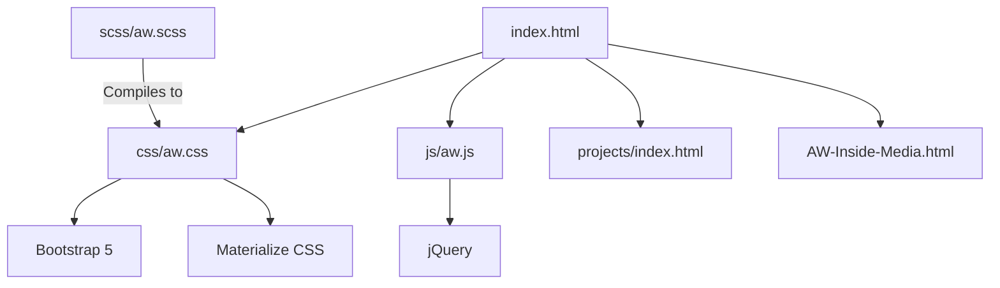

# Application Analysis: awvisual.github.io

This document provides a technical analysis of the `awvisual.github.io` repository.

## Project Overview
The application is a portfolio website for **AW Advertising Webdesign**, owned by Vandamme Wouter. It serves as a landing page to showcase various services and projects, including app development and music-related ventures (coverbands, etc.).

## Tech Stack
- **Frontend**: HTML5, CSS3 (Sass/SCSS), JavaScript.
- **Frameworks**:
  - **Bootstrap 5.2.0**: Used for layout and some components.
  - **Materialize CSS**: Used extensively for cards, buttons, and forms.
  - **jQuery 1.11.3**: Powers custom interactions and animations.
- **Iconography**: Font-Awesome 6.2.0, Material Icons, Ionicons.
- **Build Tools**: CodeKit (based on `config.codekit`).
- **Dependency Management**: Bower (legacy).

## Key Components and Logic
### 1. Main Entry Points
- `index.html`: The primary landing page (updated in 2022).
- `index-v2.html`: An alternative or older version (footer date 2016).
- `AW-Inside-Media.html`: A specialized page for internal media services.

### 2. Custom JavaScript (`js/aw.js`)
- **Greedy Navigation**: Implements a responsive menu that automatically moves items into a "more" dropdown when horizontal space is limited.
- **Scroll Effects**: Custom logic for a "scroll-to-top" button and smooth anchor scrolling.

### 3. Styling
- Uses SCSS for styling (`scss/aw.scss`), which compiles to `css/aw.css`.
- Leverages both Bootstrap's grid system and Materialize's card/form components.

## Observations and Potential Issues
- **Style Conflict Risk**: The project mixes Bootstrap and Materialize classes (e.g., `col-md-5` from Bootstrap and `row`/`col` from Materialize). This can lead to unexpected layout behavior or bloated CSS.
- **Code Gaps**: `projects/index.html` appears to be a stub or template with placeholder content ("PROJECT 1", "PROJECT 2").
- **Bugs Found**:
  - In [projects/index.html](file:///c:/Program%20Files/Ampps/www/awvisual.github.io/projects/index.html#L37-L39), there is raw SCSS code accidentally pasted into an HTML class attribute:
    ```html
    <div class="container projects margin-t-te {
        margin-top: $marg-top-te;
    }">
    ```
- **Maintenance**: The use of Bower and jQuery 1.11.3 suggests this is an older project that has been partially updated but retains legacy dependencies.

## Architecture Diagram

